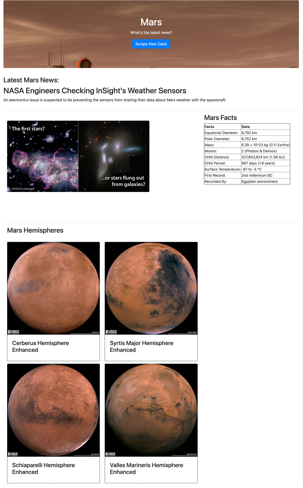

# Mission to Mars Information Dashboard
Utilizing the Beautiful Soup Python library and Splinter to scrape and navigate multiple Mars related sites. I built a Flask app that populates my Mission to Mars html page using the scraped information. All-together creating a current Mars news and information dashboard!
---

